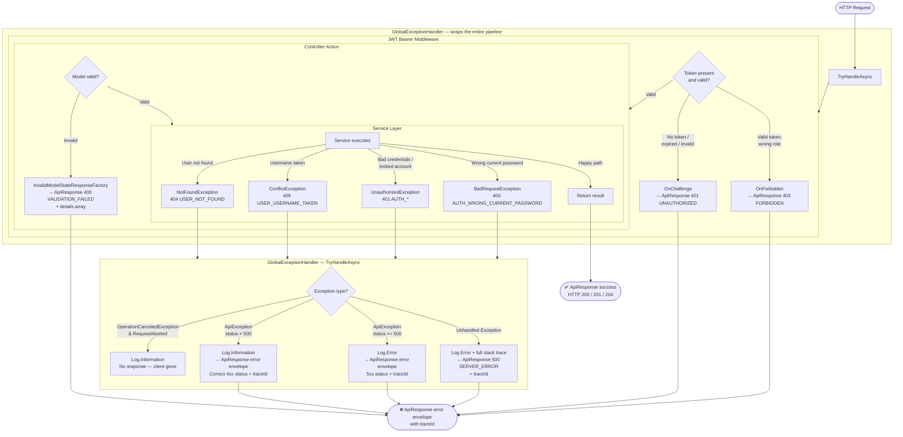

# Exception Flow — Prive API

> This document describes how exceptions travel through the application and how each
> type is translated into an HTTP response. Read alongside [`ApiException.cs`](../Infrastructure/Http/ApiException.cs) and [`GlobalExceptionHandler.cs`](../Infrastructure/Errors/GlobalExceptionHandler.cs).

---

## Exception Hierarchy

```
Exception  (BCL)
└── ApiException                    Infrastructure/Http/ApiException.cs
    │   StatusCode: HttpStatusCode
    │   Code:       string  (e.g. "USER_NOT_FOUND")
    │   Message:    string  (user-facing)
    │
    ├── NotFoundException      → 404
    ├── ConflictException      → 409
    ├── UnauthorizedException  → 401
    ├── BadRequestException    → 400
    └── ForbiddenException     → 403
```

**Rule:** Services throw derived exceptions. Controllers throw nothing (pure happy-path).
The global exception handler translates all exceptions to responses.

---

## Full Request Lifecycle — Flow Diagram



---

## Log Level Policy

| Situation | Level | Rationale |
|---|---|---|
| Client disconnect (`OperationCanceledException`) | `Information` | Not a fault — client left |
| 4xx `ApiException` (404, 401, 409…) | `Information` | Expected client behaviour |
| 5xx `ApiException` (misconfigured throw) | `Error` | Unexpected |
| Unhandled `Exception` | `Error` + full stack trace | Always a bug |
| JWT `OnChallenge` / `OnForbidden` | _(handled by JWT middleware, not logged here)_ | — |

> **Tip:** In production, alert on `Error` log entries only.
> `Information`-level client errors are useful for traffic analysis but should not page on-call.

---

## Exception Throw Sites

### Auth — [`AuthService.cs`](../Modules/Auth/AuthService.cs)

| Condition | Exception | Code |
|---|---|---|
| Username not found | `UnauthorizedException` | `AUTH_INVALID_CREDENTIALS` |
| Account deactivated | `UnauthorizedException` | `AUTH_ACCOUNT_DEACTIVATED` |
| Account locked (too many attempts) | `UnauthorizedException` | `AUTH_ACCOUNT_LOCKED` |
| Wrong password (login) | `UnauthorizedException` | `AUTH_INVALID_CREDENTIALS` |
| Refresh token invalid / revoked / expired | `UnauthorizedException` | `AUTH_SESSION_EXPIRED` |
| User not found (change-password) | `NotFoundException` | `USER_NOT_FOUND` |
| Wrong current password | `BadRequestException` | `AUTH_WRONG_CURRENT_PASSWORD` |

### User — [`UserService.cs`](../Modules/User/UserService.cs)

| Condition | Exception | Code |
|---|---|---|
| User not found | `NotFoundException` | `USER_NOT_FOUND` |
| Username already taken | `ConflictException` | `USER_USERNAME_TAKEN` |

---

## Response Envelope (All Error Paths)

Every error — whether from the exception handler, JWT events, or validation factory — produces the
same envelope shape:

```json
{
  "success": false,
  "error": {
    "code": "USER_NOT_FOUND",
    "message": "User with id '...' was not found.",
    "traceId": "0HN4K1F2Q8B3R:00000001"
  }
}
```

Validation errors include a `details` array (only on `VALIDATION_FAILED`):

```json
{
  "success": false,
  "error": {
    "code": "VALIDATION_FAILED",
    "message": "One or more validation errors occurred.",
    "traceId": "0HN4K1F2Q8B3R:00000002",
    "details": [
      { "field": "username", "message": "The Username field is required." },
      { "field": "password", "message": "Password must be at least 8 characters." }
    ]
  }
}
```

---

## Adding a New Exception Type

### Using an existing HTTP status

Pick the derived exception that matches the HTTP status:

```csharp
throw new NotFoundException(ErrorCodes.MyModule.SomethingMissing, "Resource not found.");
throw new ConflictException(ErrorCodes.MyModule.DuplicateKey, "Already exists.");
throw new UnauthorizedException(ErrorCodes.Auth.SessionExpired, "Please log in again.");
```

### Introducing a new HTTP status

Add a derived class to [`ApiException.cs`](../Infrastructure/Http/ApiException.cs):

```csharp
public sealed class TooManyRequestsException(string code, string message)
  : ApiException(HttpStatusCode.TooManyRequests, code, message);
```

Then add the error code constant to [`ErrorCodes.cs`](../Infrastructure/Http/ErrorCodes.cs)
under the appropriate nested class. The exception handler handles everything else automatically —
no changes needed there.

---

## Design Notes

### Password Hashing — PBKDF2, not bcrypt

`PasswordHasher<T>` from `Microsoft.AspNetCore.Identity` uses **PBKDF2-HMAC-SHA512**,
not bcrypt. This project targets **net10.0**, so the default iteration count is
**600 000 rounds** (the .NET 9+ default — .NET 8 used 100 000). This is
NIST SP 800-63B-compliant and equivalent in practical security to bcrypt for this use case.

> **Note for downgraders:** If you retarget to net8.0, the default drops to 100 000 iterations.
> Existing hashes remain readable — the iteration count is stored in the hash — but new
> passwords will be hashed with fewer rounds until you upgrade back.

### Enum Ordinal Compatibility

`UserRole` is stored in the database as a **string** via `HasConversion<string>()`, so
adding or reordering enum values does **not** break existing rows. Each row stores the
member name (`"SuperAdmin"`, `"Manager"`, etc.), not the integer ordinal.

> **Warning:** If you **rename** an enum member (e.g. `Owner` → `Proprietor`), existing
> rows will fail to deserialize at runtime. Write a data migration to update the string
> values in the database **before** deploying the rename.

### Soft Deletes — Future Consideration

`DeleteAsync` currently performs a **hard delete** (row is removed). If audit history or
referential integrity becomes important, consider:

```csharp
// On UserEntity
public bool IsDeleted { get; set; }
public DateTime? DeletedAtUtc { get; set; }
public string? DeletedBy { get; set; }
```

A global EF Core query filter (`HasQueryFilter(u => !u.IsDeleted)`) would hide deleted
records transparently across all queries. Not implemented today — requirements do not
require it and soft deletes add complexity to uniqueness constraints.

### `Database.MigrateAsync()` at Startup

[`DbSeeder`](../Shared/Persistence/DbSeeder.cs) calls `db.Database.MigrateAsync()` on
startup. Acceptability depends on deployment model:

| Scenario | Verdict |
|---|---|
| Single instance (current) | ✅ Safe and convenient |
| Multiple instances starting simultaneously | ⚠️ EF Core's migration-history lock usually prevents double-apply, but is not guaranteed |
| Large distributed / blue-green deployment | ❌ Run migrations as a separate CI/CD step before rolling out instances |

For future scale, remove `MigrateAsync()` from the seeder and add it as a deployment
pipeline step (`dotnet ef database update` or a dedicated migration job).
