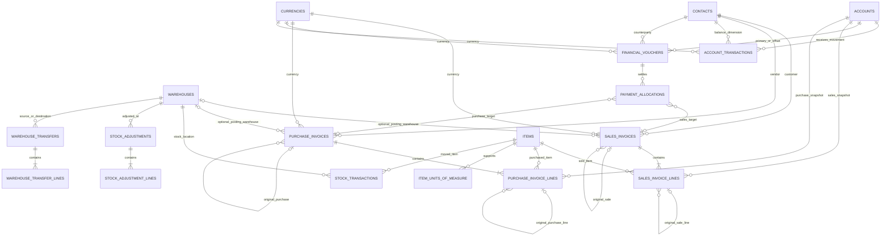

# Privé ERP Final MVP Data Model — Review Pack

**Review status:** Fully approved

**Scope:** database entities, relationships, constraints, posting semantics, derived balances, reversals, and migration safety for Sales, Purchases, Finance, Inventory, and Warehouse.

**Related documents:** [Final MVP Database Architecture](database.md), [ADR-003 Signed Operational Financial Ledger](../decisions/003-financial-ledger.md)

## 1. Review objective

Confirm that the implemented model is a simple, internally consistent operational ERP foundation for the MVP.

The review should verify:

- Sales and Purchases own separate source-document tables.
- Finance and Inventory each have exactly one authoritative ledger.
- posted records are immutable and corrections use linked reversals;
- returns are new documents linked to their originals;
- contact balances and invoice settlement remain separate concepts;
- the clean initial migration contains only the final schema;
- no statutory double-entry or other out-of-scope ERP functionality has entered the model.

## 2. Architecture summary

```text
MASTER DATA
Accounts   Contacts   Currencies   Items   ItemCategories   UnitsOfMeasure   Warehouses
                                      └── ItemUnitsOfMeasure
BusinessSettings ── BaseCurrency + Default Receivable/Payable Accounts

SALES                         PURCHASES
SalesInvoices                 PurchaseInvoices
└── SalesInvoiceLines         └── PurchaseInvoiceLines
    ├── account snapshot          ├── account snapshot
    └── original return line      └── original return line

FINANCE                       INVENTORY
FinancialVouchers             WarehouseTransfers + Lines
PaymentAllocations            StockAdjustments + Lines
AccountTransactions           StockTransactions
└── authoritative ledger      └── authoritative ledger
```

Source documents explain why a business event happened. Ledger transactions are the authoritative posted effects of that event.

## 3. Relationship view



`AccountTransactions.SourceType + SourceId` and `StockTransactions.SourceType + SourceId` are intentional polymorphic source references. They are indexed but cannot use a conventional foreign key to several source tables.

## 4. Table inventory

| Domain | Table | Purpose | Key relationships and rules |
| --- | --- | --- | --- |
| Master | `Accounts` | Shared operational accounts | Unique `Code`; typed as Cash, Bank, Receivable, Payable, Income, Expense, Inventory, or General; no balance column |
| Master | `Contacts` | Customers and vendors | No per-contact account and no stored opening/current balance |
| Master | `BusinessSettings` | Posting configuration | Database-enforced singleton with required base currency and explicit default Receivable/Payable account references |
| Master | `Items` | Products and services | Unique `Code`; optional default sales/purchase accounts during migration; services cannot track inventory |
| Master | `ItemUnitsOfMeasure` | Item-specific conversions/defaults | Unique item/UoM pair; at most one selling default and one purchasing default per item |
| Sales | `SalesInvoices` | Sale or sales return | `IsReturn` and `OriginalSalesInvoiceId`; customer, optional warehouse, base currency, lifecycle, totals |
| Sales | `SalesInvoiceLines` | Snapshotted sale lines | Item/UoM/conversion/price/account snapshots; optional original line for returns |
| Purchases | `PurchaseInvoices` | Purchase or purchase return | `IsReturn` and `OriginalPurchaseInvoiceId`; vendor, optional warehouse, base currency, lifecycle, totals |
| Purchases | `PurchaseInvoiceLines` | Snapshotted purchase lines | Item/UoM/conversion/price/account snapshots; optional original line for returns |
| Finance | `FinancialVouchers` | Receipt, Payment, or Transfer | Positive amount, two different accounts, one currency, optional contact |
| Finance | `PaymentAllocations` | Invoice-settlement metadata | Exactly one sales/purchase target; positive amount; no ledger effect |
| Finance | `AccountTransactions` | Authoritative signed financial ledger | Optional contact dimension; source reference; unique optional reversal link; append-only |
| Inventory | `StockTransactions` | Authoritative signed stock ledger | Warehouse/item balance dimensions; source reference; unique optional reversal link; append-only |
| Inventory | `StockAdjustments` | Opening/correction/damage/expiry/internal-use adjustment | Draft/Posted/Voided; one warehouse and constrained reason |
| Inventory | `StockAdjustmentLines` | Signed adjustment quantities | Nonzero quantity and positive conversion factor |
| Warehouse | `WarehouseTransfers` | Warehouse-to-warehouse movement | Source and destination must differ; Draft/Posted/Voided |
| Warehouse | `WarehouseTransferLines` | Transfer items and quantities | Positive quantity and conversion; posting creates two stock movements |

## 5. Source-document lifecycle

The following documents use the same lifecycle:

- Sales Invoice
- Purchase Invoice
- Financial Voucher
- Stock Adjustment
- Warehouse Transfer

| State | Editable | Deletable | Creates ledger rows | Exit rule |
| --- | --- | --- | --- | --- |
| Draft | Yes | Yes | No | Validate and post atomically |
| Posted | No | No | Yes | Void only through reversal |
| Voided | No | No | Original plus reversal rows remain | Terminal for MVP |

Posting updates the document and appends all financial/stock movements in one serializable database transaction. A conditional status update claims `Draft -> Posted`; a concurrent or retried loser receives a conflict and cannot create duplicate or partial movements. The same transaction protects stock-availability and other aggregate validations.

## 6. Posting matrix

All source-document quantities and totals are positive. The business event determines the ledger sign.

| Event | Financial movements | Stock movement |
| --- | --- | --- |
| Sale | Customer Receivables `+Total`; Sales Income `+line amounts` | Tracked product `-QuantityBase` |
| Sales return | Customer Receivables `-Total`; Sales Income `-line amounts` | Tracked product `+QuantityBase` |
| Purchase | Vendor Payables `+Total`; Purchase/Expense `+line amounts` | Tracked product `+QuantityBase` |
| Purchase return | Vendor Payables `-Total`; Purchase/Expense `-line amounts` | Tracked product `-QuantityBase` |
| Customer receipt | Cash/Bank `+Amount`; Customer Receivables `-Amount` | None |
| Vendor payment | Cash/Bank `-Amount`; Vendor Payables `-Amount` | None |
| Direct expense payment | Cash/Bank `-Amount`; Expense `+Amount` | None |
| Internal transfer | Source `-Amount`; Destination `+Amount` | None |
| Warehouse transfer | None | Source `-QuantityBase`; destination `+QuantityBase` |
| Stock adjustment | None | Signed adjustment quantity |

Services must not generate stock transactions.

Invoices and vouchers use only `BusinessSettings.BaseCurrencyId`, whose configured exchange rate is `1`. Every generated financial movement has `Amount = BaseAmount`, enforced by both the ledger service and a database check. Invoice line subtotals are rounded at the configured monetary precision, and header subtotal, discount, and total must reconcile exactly before posting.

## 7. Balance definitions

### Account balance

```text
SUM(AccountTransactions.BaseAmount)
WHERE AccountId = selected account
```

### Customer or vendor balance

```text
SUM(AccountTransactions.BaseAmount)
WHERE AccountId = shared receivable/payable account
  AND ContactId = selected contact
```

### Stock on hand

```text
SUM(StockTransactions.QuantityBase)
WHERE WarehouseId = selected warehouse
  AND ItemId = selected item
```

### Invoice outstanding

```text
Invoice Total
- Active matching PaymentAllocations
- Linked posted returns
```

Invoice outstanding is not the general customer/vendor balance. Advances, unallocated payments, opening balances, and manual adjustments appear in the general ledger balance without necessarily belonging to an invoice.

## 8. Returns and reversals

Returns and reversals solve different problems:

- A return is a new commercial document tied to the original invoice and original lines.
- A reversal corrects or voids posted ledger effects without deleting history.

Database constraints enforce the presence/absence of return links and prevent more than one direct reversal link to the same ledger transaction. Services must additionally verify:

- the original invoice is posted and is not itself a return;
- the contact and currency match;
- each return line belongs to the linked original invoice and uses the same item;
- account, UoM, conversion factor, and unit price exactly match the original line snapshot;
- cumulative returned quantity does not exceed original quantity;
- reversal dimensions match the original and amount/quantity is its exact negative.

## 9. Payment-allocation rules

An allocation never creates an `AccountTransaction`. The voucher posts money once; allocations only describe settlement.

The database enforces:

- `AllocatedAmount > 0`;
- exactly one invoice target;
- restricted foreign keys;
- at most one active allocation from the same voucher to the same invoice target.

The application must enforce:

- Receipt may settle only Sales Invoices;
- Payment may settle only Purchase Invoices;
- the target is a normal invoice, never a return;
- voucher and invoice contact match;
- voucher and invoice currency match;
- total active allocations do not exceed voucher amount;
- an allocation does not exceed invoice outstanding.

Allocation creation requires the voucher itself to be active, Posted, and non-Transfer. It locks both the voucher row and target invoice row before aggregate checks, inside the serializable transaction, so concurrent allocations cannot over-allocate either side.

Voiding a financial voucher deactivates its active allocations while reversing its account movements in the same transaction. A sales or purchase invoice cannot be voided until its active allocations and any linked Posted returns have been reversed.

## 10. Database versus application enforcement

| Invariant | Database | Application |
| --- | --- | --- |
| Unique account/item/document codes | Yes | Friendly duplicate error |
| Service cannot track inventory | Yes | Form and posting validation |
| Return header link matches `IsReturn` | Yes | Original status/contact/currency validation |
| Positive document/transfer quantities | Yes | Total and conversion validation |
| Exactly one allocation target | Yes | Voucher type/contact/currency/outstanding checks |
| One direct reversal per ledger row | Yes | Exact-opposite and source-state validation |
| Ledger rows cannot be modified through EF | Append-only context guard | Do not use bulk update/delete paths |
| Posted documents are immutable | No | Context guard plus explicit service transitions |
| Posting is atomic and idempotent | No | Serializable transaction plus conditional state claim |
| Returnable quantity | No | Aggregate query in posting service |
| Allocation totals and invoice outstanding | No | Aggregate query in allocation service |
| Stock cannot become negative | No | Serializable balance query and movement insert |
| Valid polymorphic `SourceType + SourceId` | No | Posting service owns source integrity |
| Valid document/operational enum values | Yes | Database range/set checks plus typed enums |
| Direct self-reference | Yes | Checks reject self-parent, self-return, and self-reversal links |
| Base-currency amount equality | Yes | `Amount = BaseAmount` check and ledger-service validation |

## 11. Index review

The implemented indexes cover the required access paths:

- financial history by `(AccountId, TransactionDateUtc)`;
- contact history by `(ContactId, TransactionDateUtc)`;
- contact account statements by `(ContactId, AccountId, TransactionDateUtc)`;
- financial and stock transactions by `(SourceType, SourceId)`;
- stock balance/history by `(WarehouseId, ItemId, TransactionDateUtc)`;
- sales documents by `(CustomerId, InvoiceDateUtc)`;
- purchase documents by `(VendorId, InvoiceDateUtc)`;
- allocations by voucher and either invoice target;
- partial unique reversal and active-allocation constraints;
- item/UoM mapping plus partial unique defaults on `ItemId` only;
- unique currency codes and singleton Business Settings.

No cached balance or stock summary tables are included.

## 12. Migration review

Migration: `20260807225956_InitialMvpArchitecture`

The experimental migration lineage was squashed because there is no important database data to preserve. This migration creates the approved model directly, including the required settings references, nullable invoice warehouses, constrained integer enums, self-reference guards, currency-code uniqueness, corrected partial unique Item-UoM and active-allocation indexes, composite contact-ledger index, reversal indexes, lifecycle checks, and final source-document and ledger tables. Generated SQL contains no duplicate `CREATE UNIQUE INDEX "PK_*"` statements.

Legacy `OperationalDocuments`, generic invoices/vouchers, double-entry journals, per-contact accounts, and stored contact balances do not exist in the final schema. Databases created from an earlier experimental migration history must be dropped and recreated; no compatibility mapping or legacy safety gate is included.

## 13. Explicitly excluded from this review

- double-entry journals and statutory general ledger;
- tax engine, fiscal periods, closing, and reconciliation;
- FX gains/losses, currency revaluation, and cross-currency settlement;
- costing, COGS automation, FIFO, and weighted average;
- orders, quotations, delivery notes, and purchase receipts;
- multi-tenancy, branches, lots, serials, payroll, commissions, loyalty, appointments, and memberships.

## 14. Remaining implementation follow-up

There are no open database-architecture or review corrections. Remaining product wiring and expanded CI coverage are non-blocking:

1. Complete the draft create/edit/read API surfaces and frontend screens for the new Sales, Purchases, Voucher, Adjustment, and Transfer documents.
2. Replace legacy finance UI routes that target removed invoice/voucher/journal contracts.
3. Extend PostgreSQL-backed CI coverage for simultaneous post, allocation, return, and stock-consumption requests. The implementation now uses explicit allocation row locks plus serializable isolation; 11 unit/model tests cover totals, corrected schema shape, posting predicates, contact roles, and immutability guards.

## 15. Sign-off checklist

- [x] Separate Sales and Purchase source documents approved
- [x] Signed operational financial ledger approved
- [x] Shared customer/vendor balance accounts approved
- [x] Payment-allocation model approved
- [x] Signed stock ledger approved
- [x] Return and reversal rules approved
- [x] Conditional warehouse behavior approved
- [x] No-negative-stock policy approved
- [x] Clean initial migration approach approved
- [x] Out-of-scope list confirmed
- [x] Legacy API/UI replacement accepted as follow-up work
